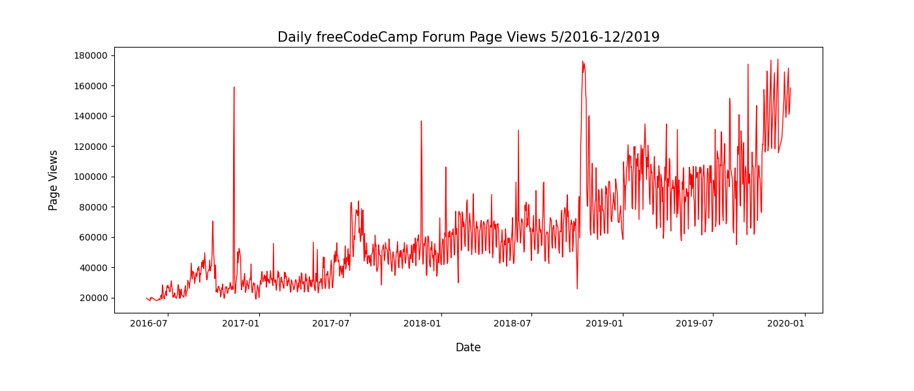
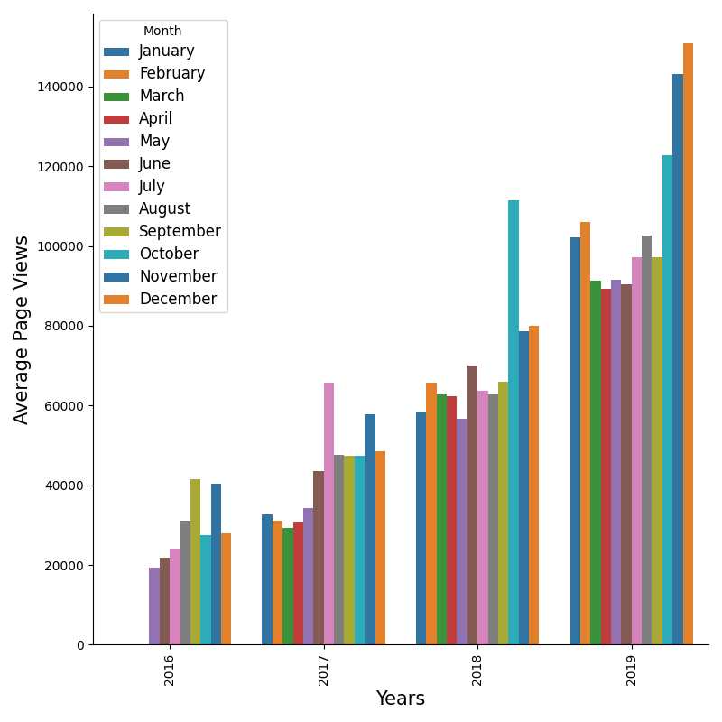
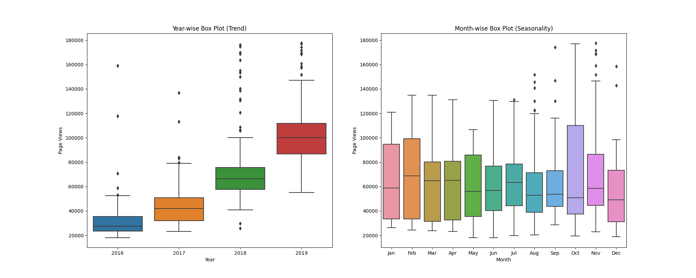

# Page View Time Series Visualizer

## Inferences

### Line Plot

- From the Line plot we can see that the views have increased linearly from 2016 to 2019
- Also we can see that in every year the first quater page views are more than other months

### Bar Plot

- From the Bar plot we can see that we have mixed inferences 
- In the year 2016 the most page views are in month of september, in 2017 it was July, in 2018 it was october and in 2019 it was December
- The most page views are in month of december with count more than 14000

### Box Plot

- If we see the box plot we can deduce that we have outliers in the data
- The first plot i.e year-wise plot we see 2016 has most outliers and 2019 has least.
- Once we look at the month-wise plot, we see that only august, september , november and december has outliers. with august and november contains the most. 
- The average page views in month-wise plot is between 5000 to 8000.